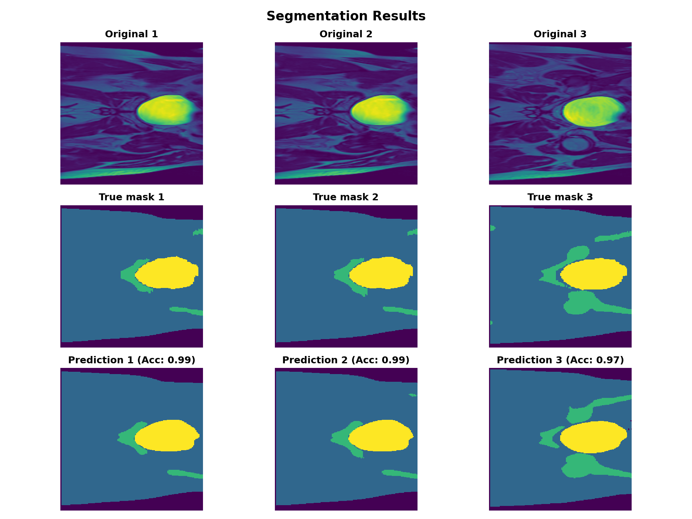
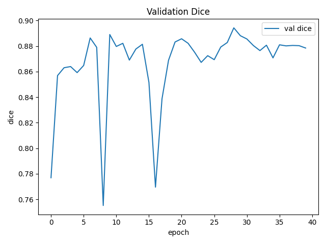
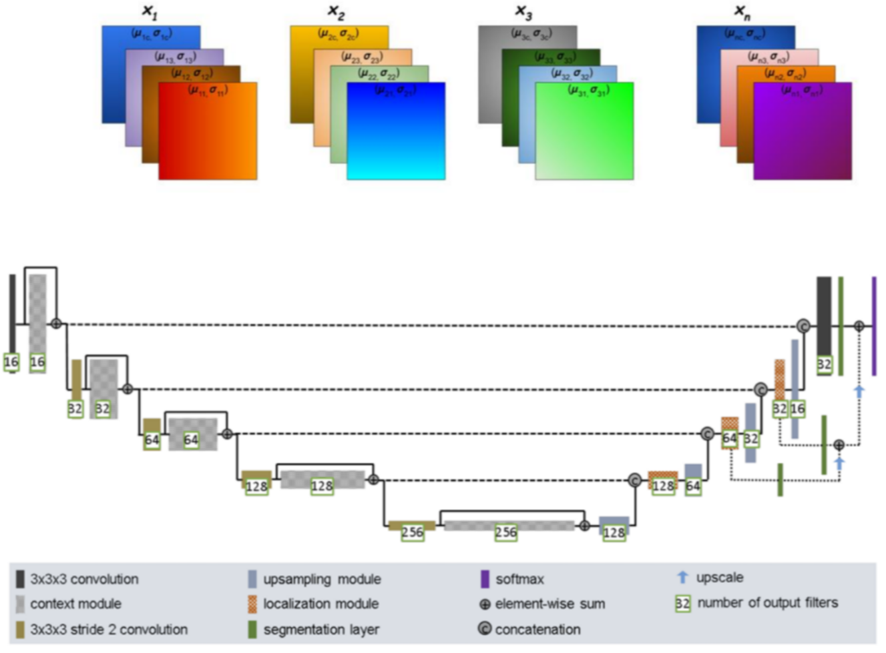

# Task 3: Segmentation with Improved U-Net on HipMRI Study on Prostate Cancer

**COMP3710 - Pattern Recognition and Analysis**
**Author** - Trond Jakob Grø Rein (s4977945)

## Overview

This project implent a multiclass segmentation pipeline to depict hip structure and prostate on MRI slices from the **HipMRI Study** dataset. It trains an **Improved U-Net** with deep supervision to predict **6 classes** (5 exlc. background) at a **256 x 256** resolution. The goal is to get realiable tissue masks to support quantitative analysis and clinical research.

**Scope & contributions.**  
- Curated a PyTorch training/evaluation stack with **Dice+Cross-Entropy** loss for class‑imbalanced segmentation.  
- Implemented a lightweight, stable (Improved) U-Net variant (pre-activation blocks, instance norm, dropout, deep supervision).  
- Reproducible data loader for NIfTI (`.nii.gz`) slices with z‑normalization and appropriate interpolation modes (bilinear for images, nearest for labels).  
- Clear training/validation/test split handling and automated logging/plots.

**Headline result.**  
Using the checkpoint selected by **best validation Dice (excluding background)**, the model achieves strong qualitative segmentations and a mean per-class Dice on the test set (no background) close to the 0.87–0.89 range observed during validation. See curves and examples below.

---

## Model Description

We use an **Improved U-Net** composed of:
- **PreActivation blocks** with `InstanceNorm2d -> SiLU -> Conv` repeated twice and a residual skip; light **Dropout2d** to reduce overfitting.
- **Encoder/decoder** with strided conv downsampling and transposed-conv upsampling; skip connections concatenate encoder features into the decoder.  
- **Deep supervision:** 1x1 heads at three decoder depths are upsampled to full resolution and **summed** before the final softmax, encouraging multi‑scale consistency.  
- **Loss:** **Dice + λ·Cross‑Entropy** (λ≈0.3). Dice term ignores background to emphasize foreground overlap; CE stabilizes per‑class logits and boundary quality.

Key configuration (defaults): single‑channel input, **6 classes**, base width 32, dropout 0.1, Adam optimizer. See `modules.py` for architecture and `utils.py` for global constants.

---

## Visualisation (figures & captions)

**Qualitative results (test set).**  
  
_Three test examples: original slice, ground‑truth mask, and prediction. Bottom row titles include pixel accuracy per sample._  (Produced by `predict.py`.)

**Training curves.**  
  
_Validation Dice (excluding background) across epochs._

  
_Training vs validation loss across epochs._  (Both exported by `train.py`.)

---

## Project Structure

- `dataset.py` - NIfTI loader for HipMRI slices; z‑norm; resize to 256; correct interpolation for image/label; train/val/test splits.  
- `modules.py` - **ImprovedUNet**, `PreActivationBlock`, and `DicePlusCELoss`.  
- `train.py` – Dataloaders, training/validation loop, best-ckpt saving by **true validation Dice**, per‑class test Dice, and plotting.  
- `predict.py` - Loads best checkpoint and saves a 3xN grid of **image / true mask / prediction**.  
- `utils.py` - Global constants and paths (image size, class count, device, default batch size/epochs, dataset roots).

Hyperparameters (e.g., image size, classes, epochs, batch size) are centralized in `utils.py` and/or exposed as CLI flags in `train.py`.

---

## Dependencies

- Python ≥ 3.9, torch, torchvision, numpy, matplotlib, nibabel, tqdm.  
- Optional CUDA GPU is auto‑detected (`DEVICE='cuda' if available else 'cpu'`).

---

## Usage — Training

Basic training (writes outputs to `./outputs/` and saves `best.pt` by **validation Dice**):

```bash
python train.py --epochs 20 --batch_size 8 --lr 1e-3 --save_dir ./outputs --in_channels 1 --base 32 --dropout 0.1
```

Outputs:
- `outputs/best.pt` – best checkpoint by validation Dice.  
- `outputs/plots/val_dice.png`, `outputs/plots/loss_curve.png` – training curves.  
- Console: per‑epoch train/val loss + val Dice; final test per‑class Dice.

---

## Usage — Inference & Analysis

Generate qualitative panels on the test set using the saved best model, best.pt must be in outputs/best.pt:

```bash
python predict.py
```

This produces `outputs/plots/predict.png` with **N=3** samples (configurable in `show_predictions`).

---

## Dataset

**HipMRI Study (open)** axial slices prepared in a Keras-style folder structure with paired segmentation masks; file format is **NIfTI (`.nii.gz`)**. Predefined subfolders: `train/`, `validate/`, `test/` and corresponding `*_seg_*` for masks. The data loader assumes filenames are aligned between image and mask folders and validates counts. Paths are defined in `utils.py`.

---

## Data Setup & Preprocessing

- **Z-normalization** per slice when `transform=True`.  
- **Resize** to 256×256: bilinear for images, **nearest** for masks to preserve integer labels.  
- Convert to tensors with shapes `(1,H,W)` for images and `(H,W)` long for masks.

---

## Model Architecture (components)


*Improved UNet architecture proposed by Isensee et al..

- **Blocks:** Pre-activation residual blocks with instance norm and SiLU, plus dropout.  
- **Encoder/Decoder:** 3 downs, bottleneck, 3 ups; skip concatenations.  
- **Deep Supervision:** 3 segmentation heads (decoder levels) upsampled and summed to produce logits.  
- **Regularization:** light dropout, Adam with weight decay; Dice+CE objective.

---

## Training Process & Configuration

- **Optimizer:** Adam (lr=1e-3, weight_decay=1e-4).  
- **Batch size:** default 8; **epochs:** default 20; single‑channel input.  
- **Selection of best ckpt:** highest **true** validation Dice (background excluded).  
- **Evaluation:** after training, reload best ckpt and compute **per-class Dice** on the test set.  
- **Logging:** plots for loss and validation Dice are saved under `outputs/plots/`.

To resume or modify hyperparameters, use the CLI flags shown above.

---

## Results — Quantitative & Qualitative

- **Validation:** Dice fluctuates in the high‑0.86–0.89 range across later epochs (see curve).  
- **Test:** Per‑class Dice is reported by `train.py`; the mean (no background) is printed at the end of the run.  
- **Qualitative:** Example panels show clean organ boundaries consistent with ground truth (see figure).

---

## Analysis of Performance Metrics

- **Loss:** training loss steadily decreases; validation loss tracks with moderate noise.
- **Dice:** early rise followed by stable plateau; occasional dips are expected from Dice variance on small classes.  
- **Potential improvements:** moderate data augmentation; lower lr in late training; increase deep‑supervision weight via loss re-balancing; adjust CE weight (λ∈[0.2,0.5]).

---

## Limitations, Ethics & Safety

- Dataset bias (site, scanner, protocol) may limit generalization.  
- Masks and predictions are **not** a clinical device and **must not** be used for diagnosis.  
- Respect data licensing/consent; secure all PHI/PII; report failures transparently.

---

## References

- F. Isensee, P. Kickingereder, W. Wick, M. Bendszus, and K. H. Maier-Hein, “Brain Tumor Segmentation and Radiomics Survival Prediction: Contribution to the BRATS 2017 Challenge,” Feb. 2018. [Online]. Available: https://arxiv.org/abs/1802.10508v1

---

--

## Declaration of Generative AI use
- As I am an exchange student, I am not quite fluent in english and have used ChatGPT 5 to help me with translations and some descriptions.
- Also have used ChatGPT 5 to help me format some code and this README.
- Also have tried to use ChatGPT 5 to help with some code debugging, tought it does not alway give a good result.
